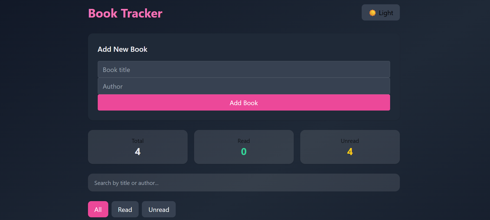
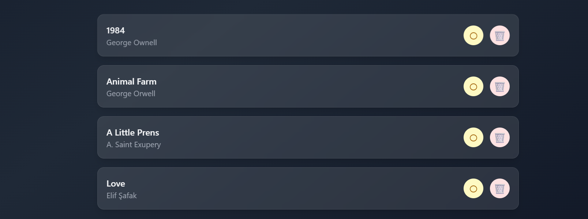
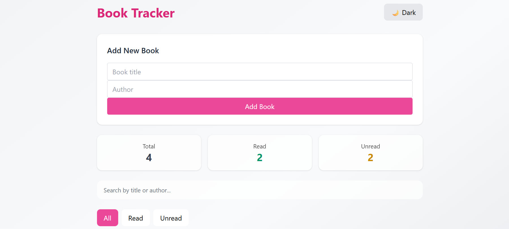

# 📚 Book Tracker App

A modern, responsive, and user-friendly **Book Tracker application** built with **React** and **Tailwind CSS**.  
This project allows users to manage their personal reading list by adding, tracking, searching, and categorizing books with a clean and premium UI.

---

## 🚀 Live Demo

🔗 **Netlify:**  
https://book-tracker-task.netlify.app/

---

## 🛠️ Technologies Used

- **React JS**
- **JavaScript (ES6+)**
- **Tailwind CSS**
- **LocalStorage**
- **Netlify (Deployment)**

---

## ✨ Features

- ➕ Add new books (title & author)
- 📋 List all books
- ✏️ Update book status (Read / Unread)
- 🗑️ Delete books with smooth animation
- 🔍 Search by title or author
- 🎯 Filter books (All / Read / Unread)

### 📊 Animated Statistics
- Total books
- Read books
- Unread books

- 🌗 Dark / Light mode (saved in LocalStorage)
- 💾 Persistent data storage with LocalStorage
- 📱 Fully responsive design (mobile-first)
- 🎨 Modern glassmorphism & premium UI

---

## 📸 Screenshots

### 🌙 Dark Mode

### 📚 Book List

### ☀️ Light Mode

ℹ️ Screenshots are located inside the `screenshots/` folder.

---

## 📂 Project Structure

src/
├── components/
│   ├── BookForm.jsx
│   ├── BookItem.jsx
│   └── BookList.jsx
│
├── pages/
│   └── Home.jsx
│
├── App.jsx
├── main.jsx
└── index.css
📌 How to Run Locally
# Clone the repository
git clone https://github.com/gozdedoner/book-tracker.git

# Navigate to the project folder
cd book-tracker

# Install dependencies
npm install

# Start the development server
npm run dev
The application will be available at:
http://localhost:5173

🎯 Project Requirements Checklist
✔ ReactJS used
✔ Tailwind CSS integrated
✔ CRUD operations (Add, List, Update, Delete)
✔ TODO-style application logic
✔ Public GitHub repository
✔ Netlify deployment
✔ Minimum 3 screenshots included

✅ All assignment requirements are fully met and exceeded.

💡 Future Improvements
📌 Drag & drop book ordering

📈 Reading progress tracking

🗓️ Reading dates & notes

📤 Export book list (PDF / CSV)

👩‍💻 Author
Gözde
Frontend Developer & UI-focused Engineer
GitHub: https://github.com/gozdedoner
